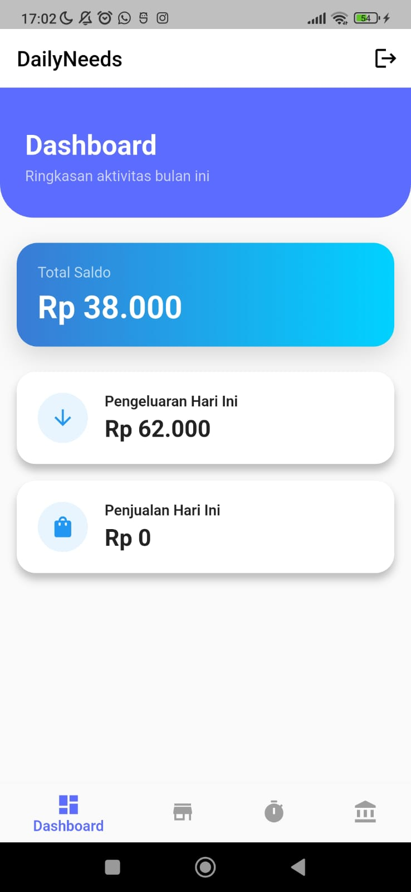
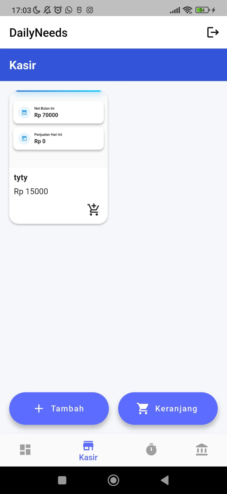
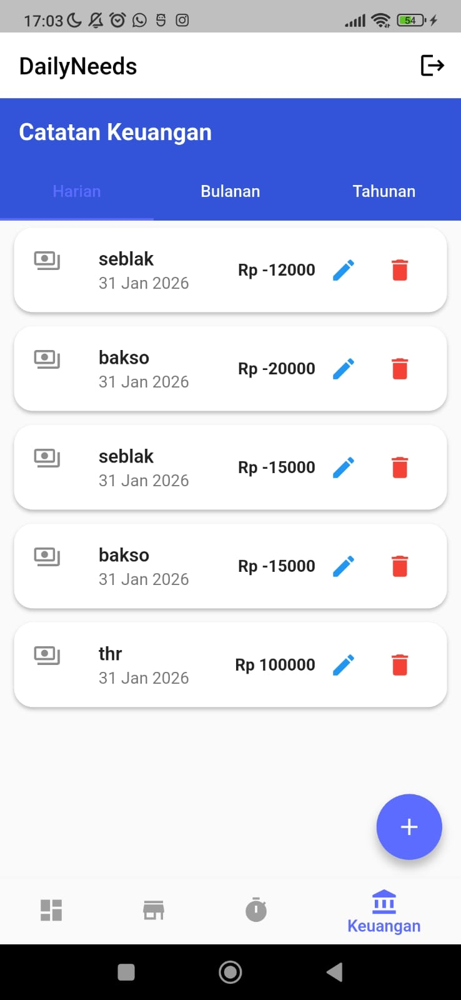
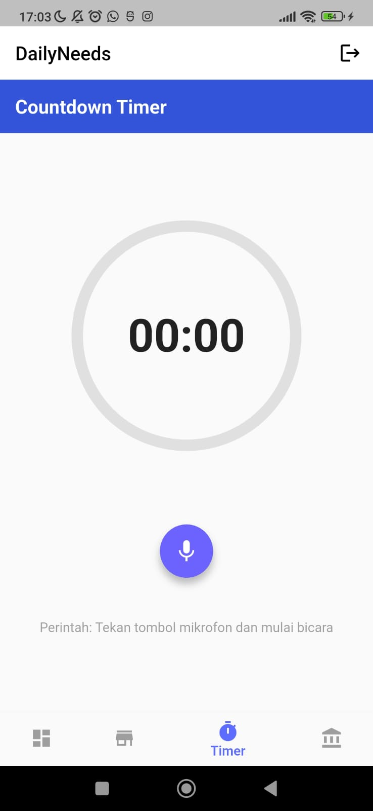
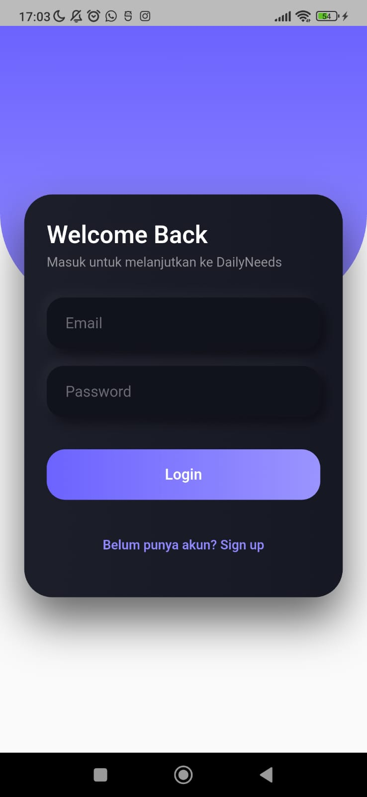
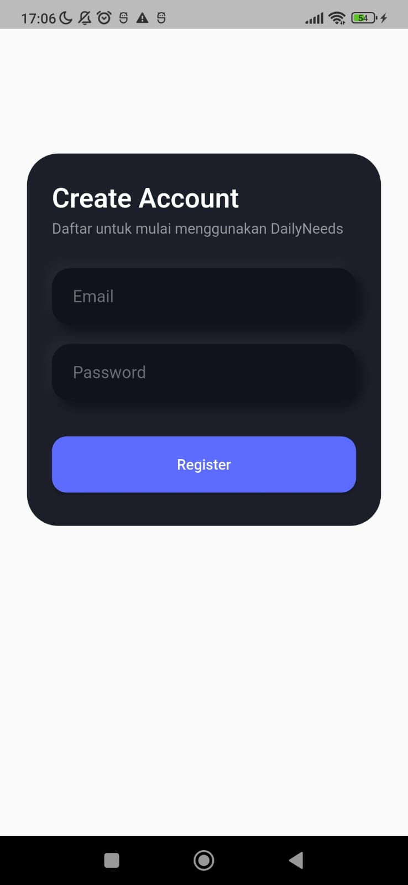

<h1 align="center">
  
  Daily Needs
</h1>

  <em>Aplikasi Mobile Flutter untuk Mendukung Kebutuhan dan Aktivitas Harian</em>

  <strong>Nama</strong> : Azmi Fauzan Alwan  
  <strong>NIM</strong> : 23552011349

 

<h2>📌 Deskripsi Aplikasi</h2>

Daily Needs merupakan aplikasi mobile berbasis Flutter yang dikembangkan
untuk membantu pengguna dalam mencatat dan mengelola aktivitas harian.
Aplikasi ini dibuat berdasarkan kebutuhan nyata yang digunakan oleh penulis,
khususnya dalam pencatatan transaksi dan pengelolaan data pendukung.

 

<h2>🎯 Tujuan Pengembangan</h2>

<ul>
  <li>Mengembangkan aplikasi mobile berbasis Flutter</li>
  <li>Menerapkan penggunaan backend dan database</li>
  <li>Membuat aplikasi yang dapat dijalankan dan digunakan</li>
</ul>

 

<h2>🗂️ Struktur Folder Aplikasi</h2>

<pre>
lib/
├── main.dart
│
├── models/
│   ├── product_model.dart
│   ├── finance_model.dart
│   └── cart_item.dart
│
├── services/
│   ├── database_service.dart
│   └── product_service.dart
│
├── pages/
│   ├── dashboard_page.dart
│   ├── dashboard_content_page.dart
│   ├── kasir_page.dart
│   ├── finance_page.dart
│   ├── finance_month_detail_page.dart
│   ├── finance_year_detail_page.dart
│   ├── timer_page.dart
│   ├── login_page.dart
│   └── register_page.dart
│
├── widgets/
│   ├── add_transaction_sheet.dart
│   └── soft_input.dart
│
└── utils/
    └── currency_formatter.dart
</pre>

 

<h2>🧩 Fitur & Halaman Aplikasi</h2>

<ul>
  <li>Dashboard</li>
  <li>Kasir / Transaksi</li>
  <li>Catatan Keuangan</li>
  <li>Timer</li>
  <li>Login & Register</li>
</ul>

 

<h2>📸 Screenshot Aplikasi</h2>

Screenshot setiap halaman aplikasi diletakkan pada folder
<code>screenshots/</code> dan ditampilkan sebagai berikut:

<ul>
  <li><strong>Dashboard</strong></li>
  

    

  <li><strong>Kasir</strong></li>
  

    

  <li><strong>Catatan Keuangan</strong></li>
  

    

  <li><strong>Timer</strong></li>
  

    

  <li><strong>Login</strong></li>
  

    

  <li><strong>Register</strong></li>
  
</ul>

 

<h2>⚙️ Teknologi yang Digunakan</h2>

<ul>
  <li>Flutter & Dart</li>
  <li>Supabase</li>
  <li>PostgreSQL</li>
</ul>

 

<h2>🚧 Status Pengembangan</h2>

Aplikasi Daily Needs berada pada tahap fungsional dan dapat digunakan.
Pengembangan lanjutan dapat dilakukan untuk peningkatan fitur dan tampilan.

 

  <em>
  Daily Needs dikembangkan sebagai bagian dari tugas perkuliahan
  dan difokuskan pada implementasi aplikasi mobile berbasis Flutter.
  </em>

